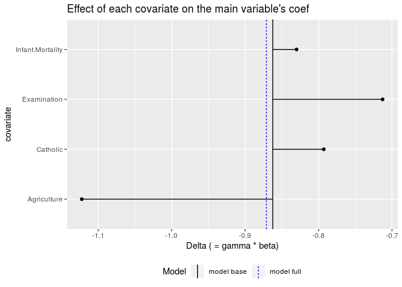
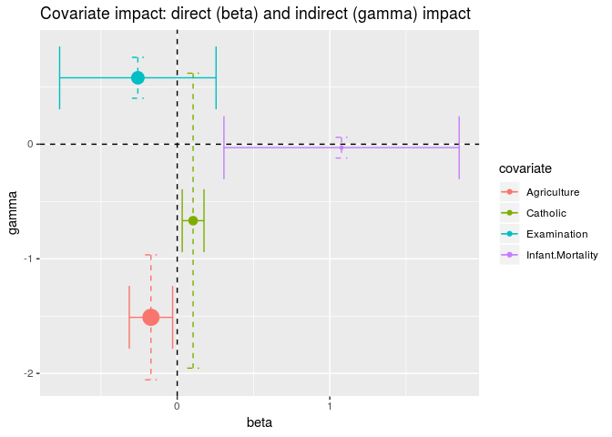

## Purpose

This code implements the basics of the paper: Gelbach (2016) *When Do Covariates Matter? And Which Ones, and How Much?* Journal of Labor Economics, 2016, vol. 34(2)

It does just do the decomposition, without inference. It does not do the grouping either: in the standard OLS case, R can do a multivariate OLS, so computing the auxiliary regressions for one or multiple LHS variables is done efficiently. User can simply use `tidyverse::group_by` tools to do the grouping. 


## Use

The function is: `dec_covar(object = , var_main)`. `var_main` is the variable of interest, as character string.

The function works for `object` of class:
 * OLS regressions computed with `lm()` 
 * panel computed with  `plm()` or `felm()` from package *lfe*


## Illustration


1) Source the script:


```r
library(devtools)
source_url("https://raw.githubusercontent.com/MatthieuStigler/Misconometrics/master/Gelbach_decompo/dec_covar.R")
```

2) Run your OLS model, with all the variables. We use here built-in data *swiss*:


```r
model_full_1 <- lm(Fertility ~ ., data=swiss)
```

3) Use the function `dec_covar` on the OLS output, specify which variable is the *main* one:


```r
dec <- dec_covar(object = model_full_1, var_main = "Education")
```


|covariate        |     beta_K| gamma_Education| delta_Education|
|:----------------|----------:|---------------:|---------------:|
|Agriculture      | -0.1721140|      -1.5105273|       0.2599829|
|Catholic         |  0.1041153|      -0.6673314|      -0.0694794|
|Examination      | -0.2580082|       0.5794737|      -0.1495090|
|Infant.Mortality |  1.0770481|      -0.0300865|      -0.0324047|
|Total            |         NA|              NA|       0.0085898|
|Check            |         NA|              NA|       0.0085898|

### Plots

You can get two plots also. You will need to use the `format="long"` argument, as well as `conf.int=TRUE` (that's just for the beta and gamma though)


```r
dec_long <- dec_covar(object = model_full_1, var_main = "Education", format = "long", add_coefs = TRUE, conf.int = TRUE)
```


```r
plot_dec(dec_long) +
  ggtitle("Effect of each covariate on the main variable's coef")
```

<!-- -->


```r
plot_gamma_beta(dec_long, add_CI = TRUE) +
  ggtitle("Covariate impact: direct (beta) and indirect (gamma) impact")
```

<!-- -->

