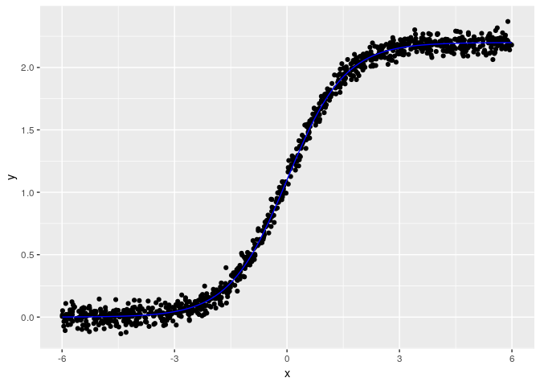
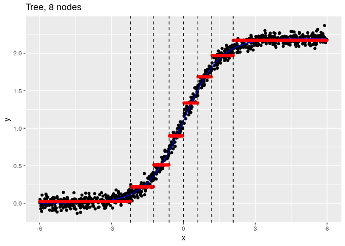
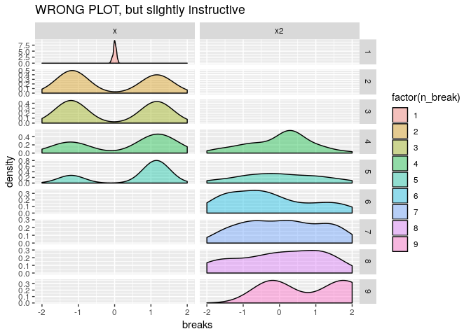
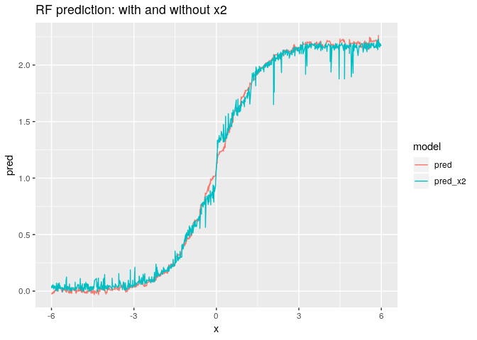
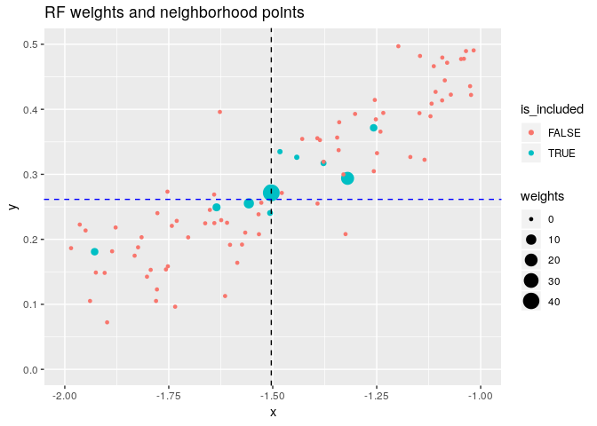
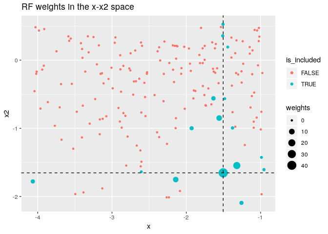
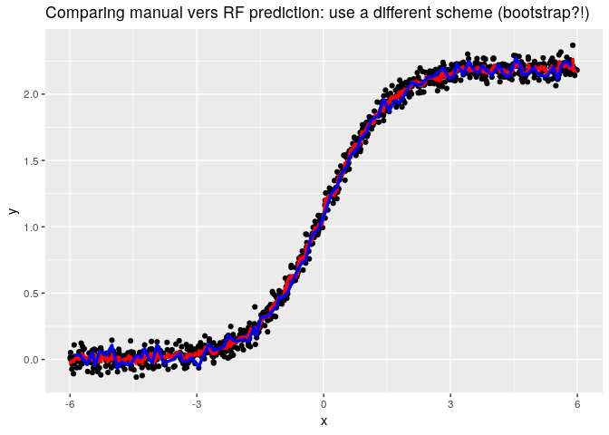

```r
library(rpart)
# library(tree)
# library(party)
library(randomForest)
library(tidyverse)
library(magrittr)
```

# Create data


```r
set.seed(123)
N <-  1000
x <-  runif(N, -6, 6)

sigmoid <-  function(x, k=1, cent = 0)  1 / (1 + exp(-k*(x-cent)))


sim_dat <-  function(N = 1000, seed = 123, add_x2 = FALSE) {
  set.seed(seed)
  x <-  runif(N, -6, 6)
  y <-  2.2 *sigmoid(x, k = 1.3) +rnorm(N, sd = 0.05)
  df <-  data_frame(y=y, x=x, n_order = rank(x)) %>%
    mutate(n_row = 1:n())
  if(add_x2) df <-  df %>% 
    mutate(x2 = rnorm(N))
  df
}

df <-  sim_dat()
df
```

```
## # A tibble: 1,000 x 4
##           y      x n_order n_row
##       <dbl>  <dbl>   <dbl> <int>
##  1  0.0471  -2.55      288     1
##  2  2.13     3.46      794     2
##  3  0.480   -1.09      415     3
##  4  2.23     4.60      885     4
##  5  2.12     5.29      940     5
##  6 -0.00292 -5.45       43     6
##  7  1.29     0.337     534     7
##  8  2.09     4.71      902     8
##  9  1.53     0.617     560     9
## 10  0.737   -0.521     463    10
## # ... with 990 more rows
```


Visu:


```r
pl_raw <- ggplot(df, aes(x, y)) +
  geom_point() +
  stat_function(fun = function(x) 2.2 *sigmoid(x, 1.3), colour = "blue") 
  # geom_vline(xintercept = target_val)

pl_raw
```

<!-- -->

# Estimate Simple tree: 

Helper functions:


```r
get_breaks <-  function(x) UseMethod("get_breaks")
get_breaks.rpart <- function(x) {
  x$splits %>% 
    as_data_frame() %>% 
    mutate(variable = rownames(x$splits)) %>% 
    select(variable, everything()) %>% 
    rename(breaks = .data$index) %>%  
    arrange(desc(.data$improve))
}

get_pred <-  function(x, ...) UseMethod("get_pred")
get_pred.rpart <- function(x) {
  if(!"x" %in% names(x)) stop("Should call model with x=TRUE")
  data_frame(pred = predict(x),
             x = as.vector(x$x)) %>% 
  dplyr::select(x, pred)
}

plot_tree <-  function(x) UseMethod("plot_tree")

plot_tree.default <-  function(x) {
  pl_raw +
    geom_point(aes(y = pred), data = get_pred(x), colour = I("red")) +
    geom_vline(aes(xintercept = breaks), data = get_breaks(x), linetype = 2)
}
```

Estimate 2 trees:


```r
fit_rpart <- rpart(y ~ x, method="anova", data=df, control = list(cp=0.01), x = TRUE)
fit_rpart_2 <- rpart(y ~ x, method="anova", data=df, control = list(cp=0.001), x = TRUE)
```


Visu:


```r
plot_tree(fit_rpart) +
  ggtitle("Tree predictions, 3 nodes")
```

<!-- -->


```r
plot_tree(fit_rpart_2) +
  ggtitle("Tree, 8 nodes")
```

<!-- -->

## What is the first, and second split?

Quick Monte Carlo:


```r
sim_breaks <-  function(N=1000, add_x2 = FALSE, formu = y~x) {
  sim_dat(N=N, seed =NULL, add_x2 = add_x2) %>% 
    rpart(formu, method="anova", data=., control = list(cp=0.01), x = TRUE) %>% 
    get_breaks() %>% 
    arrange(desc(improve)) %>% 
    mutate(n_break = 1:n())
}


sim_breaks_MC <-  rerun(100, sim_breaks()) %>% 
  bind_rows() %>% 
  mutate(n_sim = rep(1:100, each = 3))
```

### Visu:


```r
sim_breaks_MC %>% 
  ggplot(aes(x= breaks, fill = factor(n_break)))+
  geom_density(alpha = I(0.4)) +
  facet_grid(n_break~., scales = "free") +
  xlim(c(-2, 2)) +
  ggtitle("Density of 1st, 2 and third splits, 100 MC replications")
```

<!-- -->


### Estimate with two variables, one pure noise?


```r
sim_breaks_MC_x2 <-  rerun(100, sim_breaks(add_x2 = TRUE, formu = y~x + x2)) %>% 
  bind_rows() 
```


```r
sim_breaks_MC_x2 %>% 
  ggplot(aes(x= breaks, fill = factor(n_break)))+
  geom_density(alpha = I(0.4)) +
  facet_grid(n_break ~ variable, scales = "free") +
  xlim(c(-2, 2)) +
  ggtitle("WRONG PLOT, but slightly instructive ")
```

```
## Warning: Removed 90 rows containing non-finite values (stat_density).
```

```
## Warning: Groups with fewer than two data points have been dropped.
```

<!-- -->


# Estimating a forest


## Simple forest: only 1 variable (bagging!)

Start with forest with one single variable: we are actually doing bagging!

I found that we needed that `nodesize = 22` was minimizing out-of-bag error


```r
fit_RF_n22 <- randomForest(y~x, data = df, nodesize = 22)
```

Helper function


```r
get_pred.randomForest <-  function(x, x_dat = df$x) {
  pred <- predict(x)
  data_frame(x = x_dat, pred = pred)
}

get_breaks.randomForest <-  function(x) get_breaks.rpart(x)
```

Visu results:


```r
pl_raw +
  geom_line(aes(y = pred), data = get_pred(fit_RF_n22), colour = I("red"), size = I(1.2)) 
```

<!-- -->


## Add white noise variable


```r
df_x2 <-  sim_dat(add_x2 = TRUE)
fit_RF_n22_x2 <- randomForest(y~x +x2, data = df_x2, nodesize = 22)
```


```r
get_pred(fit_RF_n22) %>% 
  left_join(get_pred(fit_RF_n22_x2) %>%  rename(pred_x2 = pred), by = "x") %>% 
  gather(model, pred, starts_with("pred")) %>% 
  ggplot(aes(x = x, y = pred, colour = model)) +
  geom_line() +
  ggtitle("RF prediction: with and without x2")
```

<!-- -->


## Extract weights, for given point

We need to use a non-bagged forest!


```r
fit_RF_n3_noBag <- randomForest(y~x +x2, data = df_x2, nodesize = 3, replace = FALSE, sampsize = N, n_tree = 300)
```


Helper function:


```r
nodes_to_df <-  function(object, df_orig = df) {
  attr(predict(object, df_orig, nodes = TRUE), "nodes") %>% 
    as_tibble %>% 
    setNames(paste("tree", colnames(.), sep="_")) %>%
    bind_cols(df_orig %>%  select(starts_with("x"), y, n_row, n_order)) %>% 
    select(starts_with("x"), y , n_row, n_order, everything())
}

comp_weights_i_df <- function(nodes_df, i =target_obs) {
  comp_weights <-  function(x, i) {
    is_same_node <-  x==x[i]
    n_same <- sum(is_same_node)
    ifelse(is_same_node, 1/n_same, 0)
  }
  
  nodes_df %>% 
    mutate_at(vars(starts_with('tree')), funs(comp_weights(., i = i))) %>% 
    mutate(weights = rowMeans(select(., -x, -y, -n_row, -n_order)),
           is_target = n_row == i,
           weights_noi = ifelse(is_target, 0, weights) %>% {./sum(.)}) %>% 
    select(-starts_with("tree_")) %>% 
    select(x, y, is_target, n_row, n_order, weights, everything())
}

comp_weights_i_df_alter <-  function(object,  i = target_df$n_row) {
  object_l <- object %>% 
    gather(tree, node, starts_with("tree")) %>% 
    group_by(tree) %>% 
    filter(node == node[n_row ==  i]) %>% 
    mutate(n_obs_node = n()) %>% 
    ungroup()
  
  res_w <- object_l %>% 
    # filter(n_obs_node==3) %>% 
    count(n_row) %>% 
    arrange(desc(n)) %>% 
    mutate(weights = 100 * n/sum(n))

  df_x2 %>% 
    left_join(res_w, by = "n_row") %>% 
    mutate(is_included =! is.na(weights),
           is_target = n_row == i) %>% 
    mutate_at(c("n", "weights"), funs(ifelse(is.na(.), 0, .)))
}
```


Set target value:


```r
target_val <-  -1.5

closest_x_df <-  function(df, target) {
  mutate(df, diff = abs(x-target), n_row = 1:n()) %>% 
    arrange(diff) %>% 
    head(1)
}

target_df <-  closest_x_df(df_x2, target_val)
```


Extract for one point: -1.5


```r
fit_RF_nodes_n3 <- nodes_to_df(fit_RF_n3_noBag, df = df_x2)
# weights_df_i_n3 <- comp_weights_i_df(fit_RF_nodes_n3, i = target_df$n_row)
weights_df_i_n3_alter <-  comp_weights_i_df_alter(object = fit_RF_nodes_n3, i = target_df$n_row)
```

### Plot weights:


```r
weights_df_i_n3_alter %>% 
  filter(is_included) %>% 
  ggplot(aes(x = x, y= weights)) +
  geom_vline(xintercept = target_df$x, linetype = 2)+
  geom_point() +
  ggtitle("RF weights")
```

<!-- -->


```r
pl_curve_weights <- weights_df_i_n3_alter %>% 
  ggplot(aes(x = x, y = y, size = weights, colour = is_included)) +
  geom_point() +
  geom_vline(xintercept = target_df$x, linetype = 2) +
  ggtitle("RF weights and neighborhood points") +
  geom_hline(yintercept = weights_df_i_n3_alter %$% weighted.mean(y, weights), linetype = 2, colour = "blue")

pl_curve_weights
```

<!-- -->

Zoom:


```r
pl_curve_weights +
  xlim(c(-2, -1)) +ylim(c(0, 0.5))
```

```
## Warning: Removed 911 rows containing missing values (geom_point).
```

<!-- -->


```r
w_incl <- weights_df_i_n3_alter %>% 
  filter(is_included) %>% 
  summarise_at(c("x", "x2"), funs(min, max))
  
weights_df_i_n3_alter %>% 
  filter(between(x, w_incl$x_min, w_incl$x_max) & 
           between(x2, w_incl$x2_min, w_incl$x2_max) ) %>% 
  ggplot(aes(x=x, y = x2, colour = is_included, size =weights)) +
  geom_point() +
  geom_vline(xintercept = target_df$x, linetype = 2 )+
  geom_hline(yintercept = target_df$x2, linetype = 2) +
  ggtitle("RF weights in the x-x2 space")
```

<!-- -->


## How *adaptive* are the weights?

Idea: compute a pseudo KNN and bandwidth, by looking at the knn/width of observations amounting for 95% of weights. 

Helper functions


```r
sumry_bandw <- function(weight_df) {
  target_val_here <- filter(weight_df, is_target)$x
  
  weight_df %>% 
    mutate(diff = abs(x - target_val_here)) %>% 
    arrange(diff) %>% 
    mutate(weights_cum = cumsum(weights)) %>% 
    filter(weights_cum <= 95) %>% 
    summarise(knn = n() -1,
              width = sum(abs(range(x - target_val_here))),
              pred = weighted.mean(y, weights))
  
}

test <-  sumry_bandw(weights_df_i_n3_alter)
```


Pick up obs equally spaced over x, to evaluate weights:


```r
grid_df <- data_frame(target = quantile(df$x, probs = seq(0.01, 0.99, by = 0.01))) %>% 
  mutate(close_df = map(target, ~closest_x_df(df, .))) %>% 
  unnest(close_df) %>% 
  select(target, x , n_row)
```

Compute weights (slooow):


```r
grid_df_out <- grid_df %>% 
  # head(2) %>%
  mutate(search = map(n_row, ~comp_weights_i_df_alter(fit_RF_nodes_n3, .) %>% sumry_bandw)) %>% 
  unnest(search)
```

### Visu


```r
grid_df_out %>% 
  gather(measure, value, knn, width) %>% 
  ggplot(aes(x = target, y = value, colour = measure)) +
  geom_line() +
  facet_grid(measure~., scales = "free")+
  ggtitle("Pseudo number of neighbour and bandwidth for RF weights") +
  theme(legend.position = "none") +
  xlab("x")
```

<!-- -->

Make sure I got the correct result: not really... how does `predict.randomForest()` work? 


```r
pl_raw +
  geom_line(aes(y = pred), data = get_pred(fit_RF_n22), colour = I("red"), size = I(1.2)) +
  geom_line(aes(y = pred), data = grid_df_out, colour = I("blue"), size = I(1.2)) +
  ggtitle("Comparing manual vers RF prediction: use a different scheme (bootstrap?!)")
```

<!-- -->

